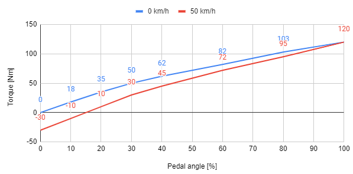

# Interview-case

Note: the assignment and the tools used are not necessarily similar to what we do/use in reality!

## Environment
We assume you have a Linux environment in which you can use git/gcc/g++ (can be native Linux, a virtual machine, WSL, MinGW). If you don’t have such an environment yet the fastest is probably if you install Git for Windows, which comes with a bash console with git and gcc installed.

Additionally, you optionally might want to install doxygen and plantuml, but you can do without.

Please have a look at this repo and all the files that it contains.

## Functional description

For the drivetrain of a prototype vehicle you are asked to implement the part that determines the requested torque based on the user input. The user does this by pressing the throttle pedal.

There are multiple options regarding the throttle pedal, but for now the engineers seem to have selected one that produces two analog output signals, which are connected to a microcontroller. 

The relation between the analog signals (redundant for safety reasons) and the pedal angle (min = 0 degrees, max = 30 degrees) are as follows:

- `adc1 = 0.5 + 0.1 * angle`
- `adc2 = 1.0 + 0.08 * angle`

Where adc1 and adc2 are voltages and the angle is in degrees. These analog inputs require some basic low pass filtering (moving average).

This pedal angle corresponds to an amount of torque that the motors must provide. This torque is not only dependent on the pedal angle, it’s also dependent on the current speed of the vehicle. The torque for each speed and pedal angle can be found in the graph below.

In case something goes wrong, in our prototype an LED should light up on the dashboard to indicate something is wrong (in a real production vehicle an error message will be shown on the instrument cluster).

## What do you have to do?

1. Create a feature branch on which you can make your changes named “feature/yyyy_mm_dd_your_first_name” on which you commit your changes.
2. Describe your “high level” design in doc/mainpage.dox (doxygen style). If you want to add diagrams you can use whatever tool you like, e.g. plantUML or draw.io.
3. Create the associated C code in src/.
4. Document your code (everything in English) using Doxygen. Examples can be found in the already existing code.
5. When you are done, please commit your changes, zip the repo and send it back.

The following commands might come in handy:

- To compile: `gcc $(find src -name "*.c") -Isrc -o main`
- To generate the documentation: `doxygen doc/Doxyfile`.
  Afterwards you can open the generated html that’s at doxygen_output/html/index.html

Please note:

- This assignment is not intended to keep you busy for a long time. If there are things that you believe are important that are missing or wrong that you would (suggest to) do if this
was a real-life task and you would have more time, then please write that down in doc/mainpage.dox.
- We are not interested in code that creates/schedules RTOS tasks or something like that. Briefly explain verbally how you believe that should work in the documentation and in src/main.c put some code that demonstrates your code a bit.
- If you don’t have doxygen installed or are struggling with it (for example because it’s new for you), don’t worry too much about how the html is generated. We can have a look at the .dox file itself as well.
